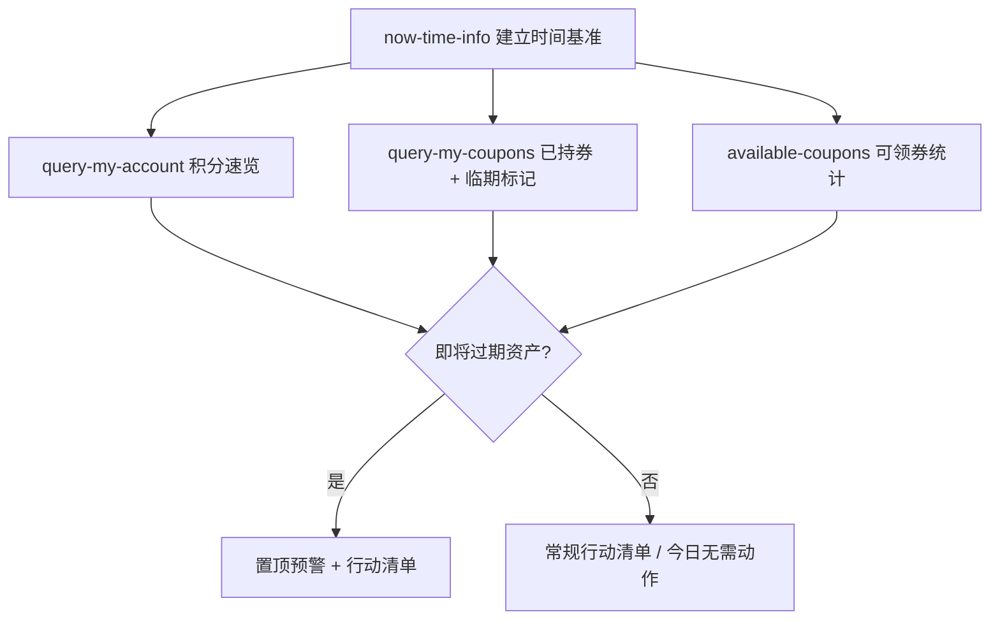
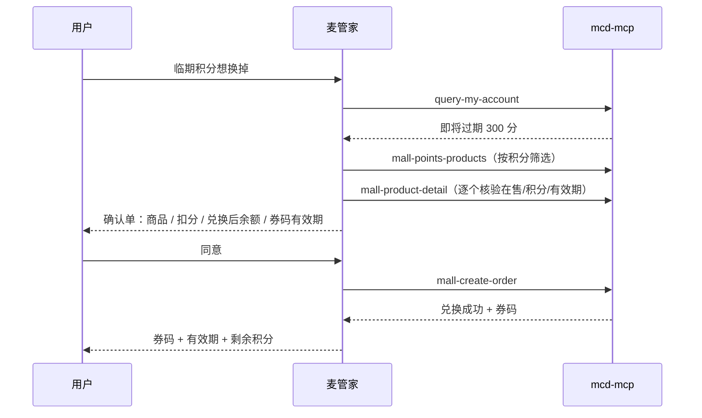
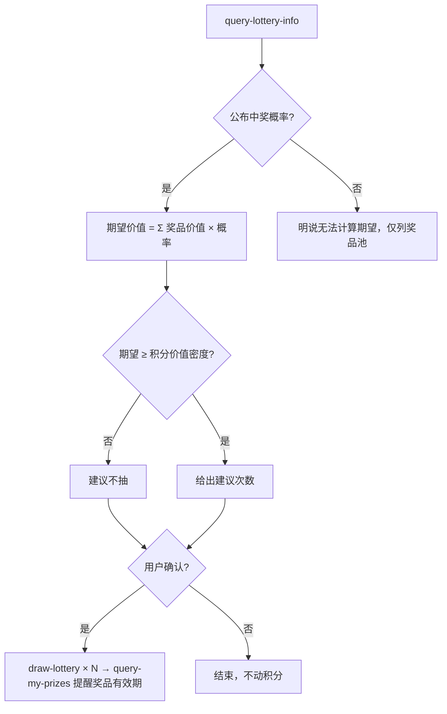

# MCP 集成说明（MCP Integration）

本文档说明麦管家实际使用的麦当劳 MCP Server、Tool、调用流程与业务价值。

## 使用的 MCP Server

| 项 | 值 |
|---|---|
| Server 名称 | `mcd-mcp`（麦当劳中国官方 MCP Server） |
| 接入地址 | `https://mcp.mcd.cn` |
| 传输协议 | Streamable HTTP |
| 鉴权方式 | `Authorization: Bearer <MCP_TOKEN>`（Token 在 [open.mcd.cn/mcp](https://open.mcd.cn/mcp) 控制台申请） |
| 限流 | 600 次 / 分钟 / Token，超限返回 429（麦管家内置合并调用与 429 提示逻辑） |

## 使用的 Tools（18 个：16 个核心 + 2 个辅助引用）

### 资产盘点

| Tool | 用途 | 在麦管家中的角色 |
|---|---|---|
| `now-time-info` | 获取当前完整时间 | 每次会话第一个调用，建立时间基准，所有「临期/过期」判断的锚点 |
| `query-my-account` | 查询积分账户（可用/累计/冻结/**即将过期**积分） | 资产巡检与积分急救的入口；「即将过期积分 > 0」触发最高优先级预警 |
| `query-my-coupons` | 查询账户已持有的可用优惠券 | 识别「已领未用」与临期券 |
| `order-list` | 查询近期到店/外送历史订单 | 资产月报复盘；兑换推荐时参考用户历史品类偏好 |

### 领券与用券

| Tool | 用途 | 在麦管家中的角色 |
|---|---|---|
| `available-coupons` | 查询麦麦省当前可领的优惠券列表 | 巡检时报告「可领 N 张、总价值 X」 |
| `auto-bind-coupons` | 一键领取全部可用优惠券 | 经用户同意后执行，随后用 `query-my-coupons` 复核到账 |
| `query-store-coupons` | 查询当前门店可用优惠券 | 点餐场景联动：门店维度二次核验（本专家不点餐，仅提示用券时机） |

### 积分商城

| Tool | 用途 | 在麦管家中的角色 |
|---|---|---|
| `mall-points-products` | 查询商城可兑换商品列表 | 积分急救时按积分范围筛选候选 |
| `mall-product-detail` | 查询商品详情（图片/积分/有效期/使用说明） | **下单前强制核验**：在售状态、所需积分、有效期 |
| `mall-create-order` | 积分兑换下单 | 输出确认单并获用户同意后执行，回报券码与有效期 |
| `mall-order-list` / `mall-order-detail` | 商城订单查询 | 月报复盘；确认兑换品类偏好 |

### 抽奖与活动

| Tool | 用途 | 在麦管家中的角色 |
|---|---|---|
| `query-lottery-info` | 查询积分抽奖活动（状态/奖品池/消耗规则/可用次数） | 抽奖参谋第一步：拿到决策所需全部事实 |
| `draw-lottery` | 执行一次积分抽奖 | 仅在用户确认次数后执行 |
| `query-my-prizes` | 查看我的奖品 | 中奖后提醒奖品有效期 |
| `campaign-calendar` | 查询当月营销活动日历 | 攒分节奏建议（如等待翻倍活动） |

> 另外引用 `list-nutrition-foods`（餐品营养）做「热量换积分」等趣味搭配参考，非核心链路。
> 另引用 `calculate-price`（实付价核验）做点餐联动场景下的「券后实付价」验证，仅提示用户核对，非核心兑换链路。

## 核心调用流程

### 流程一：资产巡检（默认入口）

### 流程二：积分急救（临期兑换）

### 流程三：抽奖参谋

## 设计约束（为什么这样编排）

1. **有效期是硬约束**：所有流程以 `now-time-info` 开头、以「即将过期资产」为最高优先级，因为过期即归零，任何优化都排在它后面。
2. **消耗类操作双重确认**：`mall-create-order` / `draw-lottery` 会真实扣减积分，麦管家在调用前必须输出确认单（金额、扣减、退换规则），杜绝误操作。
3. **决策依赖详情页，不依赖列表页**：列表数据用于筛选，`mall-product-detail` 的有效期与使用说明才是下单依据——工具没返回的字段明确标注「无法确认」，绝不编造。
4. **限流友好**：巡检一次会话固定 3-4 次调用，兑换链路 ≤6 次，远低于 600 次/分钟限制；遇 429 提示稍后再试，不自动重试轰炸。

## 业务价值

- **减少无声损失**：积分过期、券闲置是最典型的「沉默资产流失」，麦管家把它们变成每次对话的第一行输出。
- **把决策成本降到一句话**：「换什么、抽不抽、哪张券先用」这类问题从自己翻 App 变成问一句。
- **不越界**：点餐、支付引导回官方渠道完成；麦管家只管「资产决策」这一层，与点餐类 Skill 形成互补而非重复。
